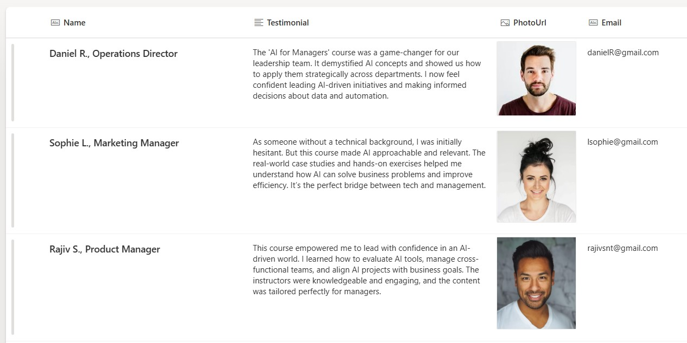

# Testimonials
## Summary
This is a SharePoint Gallery design with testimonials.

## View requirements

|Type               |Internal Name|Required|
|-------------------|-------------|:------:|
|Hyperlink          |PhotoURL     |Yes     |
|Title (Text)       |Name         |Yes     |
|Text               |Testimonial  |Yes     |
|Text               |Email        |Yes     |

*Notes: 
Set initial columns in a following format:

## Sample

Solution|Author(s)
--------|---------
[testimonials.json]([https://github.com/Sophiegold/SP-Gallery-Testimonials/blob/main/testimonials.json])| [Sophie Goldstein]([https://github.com/tecchan1107](https://github.com/Sophiegold))

## Version history

Version |Date              |Comments
--------|------------------|--------------------------------
1.0     |Aug 10, 2025      |Initial release

## Disclaimer
**THIS CODE IS PROVIDED *AS IS* WITHOUT WARRANTY OF ANY KIND, EITHER EXPRESS OR IMPLIED, INCLUDING ANY IMPLIED WARRANTIES OF FITNESS FOR A PARTICULAR PURPOSE, MERCHANTABILITY, OR NON-INFRINGEMENT.**

